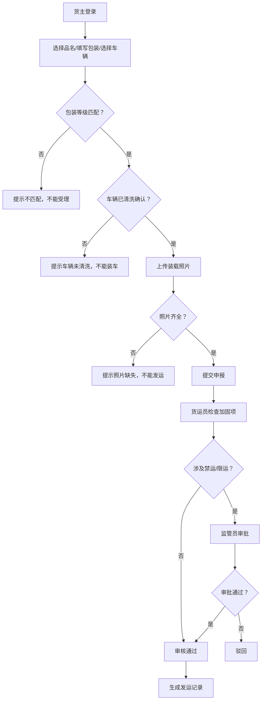

## 1. 产品概述

铁路危险货物装载检查系统，用于规范铁路危险货物运输的装载检查流程，服务货主、货运员和安全监管员三类用户，确保危险货物运输安全合规。

- 解决问题：危险货物装载环节缺乏系统化检查手段，包装等级、车辆状态、装载照片等关键要素难以有效管控
- 目标用户：货主（托运申报）、货运员（现场检查）、安全监管员（合规监督）
- 产品价值：降低危险货物运输安全风险，提升检查效率，实现全流程可追溯

## 2. 核心功能

### 2.1 用户角色

| 角色 | 登录方式 | 核心权限 |
|------|----------|----------|
| 货主 | 账号登录 | 提交品名、包装、车辆信息；查看申报状态；上传装载照片 |
| 货运员 | 账号登录 | 执行装载加固检查；确认车辆清洗状态；检查装载照片；审核发运 |
| 安全监管员 | 账号登录 | 处理禁运/限运审批；查看所有发运记录；违规处置；数据统计 |

### 2.2 功能模块

1. **登录与身份选择页**：角色切换登录、权限验证
2. **货主申报页**：品名选择、包装等级、车辆信息填报、照片上传
3. **货运员检查页**：待检任务列表、装载加固检查、车辆清洗确认、照片核验
4. **监管员审批页**：禁运限运处理、全量发运记录、违规处置、数据看板
5. **发运记录详情页**：单条记录全流程信息展示

### 2.3 页面详情

| 页面名称 | 模块名称 | 功能描述 |
|----------|----------|----------|
| 登录页 | 登录表单 | 账号密码输入、角色选择、登录验证 |
| 货主申报页 | 品名申报 | 从危险品目录选择品名，自动带出包装要求 |
| 货主申报页 | 包装信息 | 输入包装等级、包装方式，系统校验匹配性 |
| 货主申报页 | 车辆信息 | 选择车辆编号，查看车辆状态（清洗/未清洗） |
| 货主申报页 | 照片上传 | 上传装载照片，支持多图 |
| 货主申报页 | 提交申报 | 校验通过后提交，生成申报单号 |
| 货运员检查页 | 任务列表 | 按状态筛选待检查任务，搜索定位 |
| 货运员检查页 | 加固检查 | 勾选装载加固检查项，填写检查结果与备注 |
| 货运员检查页 | 车辆确认 | 确认车辆清洗状态，已清洗才能进入下一步 |
| 货运员检查页 | 照片核验 | 查看上传照片，确认照片完整性 |
| 货运员检查页 | 审核发运 | 三项检查全通过后审核通过，否则驳回 |
| 监管员审批页 | 禁限运处理 | 查看需审批的禁运/限运品名，审批通过或驳回 |
| 监管员审批页 | 发运记录 | 全量记录查询、按状态/时间/品名筛选 |
| 监管员审批页 | 数据看板 | 申报量、通过率、违规类型统计图表 |
| 发运详情页 | 流程时间线 | 申报→检查→审批→发运全流程节点展示 |
| 发运详情页 | 信息详情 | 品名、包装、车辆、检查项、照片完整信息 |

## 3. 核心流程

货主选择危险品名并填报包装等级与车辆信息，系统校验包装等级匹配性和车辆清洗状态；校验通过后货主上传装载照片并提交申报。货运员接收任务，依次执行装载加固检查、车辆清洗二次确认、装载照片核验，三项全部通过则审核通过，否则驳回。如涉及禁运或限运品名，自动流转至安全监管员进行审批。全部环节通过后方可发运，系统生成发运记录。

## 4. 用户界面设计

### 4.1 设计风格

- **主色调**：深铁路蓝（#1a365d）作为品牌色，搭配警示橙（#dd6b20）用于危险等级标识，安全绿（#38a169）用于通过状态
- **辅色**：中性灰（#2d3748 / #4a5568 / #a0aec0）用于文本与分割线
- **按钮风格**：Material Design 风格，圆角 8px，主按钮带微阴影，危险按钮用红色系
- **字体**：Noto Sans SC 作为中文显示字体，Roboto 作为数字与英文补充
- **布局风格**：左侧导航栏 + 顶部用户信息栏 + 右侧内容区的经典后台布局，卡片式信息分组
- **图标风格**：Material Icons 圆角风格，危险品名配警示图标，通过状态配对勾图标

### 4.2 页面设计概览

| 页面名称 | 模块名称 | UI 元素 |
|----------|----------|---------|
| 登录页 | 登录卡片 | 居中卡片、铁路蓝主色、角色 Tab 切换、输入框带图标 |
| 货主申报页 | 表单区域 | 分步表单（品名→包装→车辆→照片→提交）、步骤指示器、危险等级标签 |
| 货运员检查页 | 任务列表 | 数据表格、状态徽章、搜索筛选栏、批量操作 |
| 货运员检查页 | 检查卡片 | 勾选式检查项、可折叠分组、必填项星标、文本备注区 |
| 监管员审批页 | 数据看板 | 统计卡片、柱状图/饼图、关键指标数字大号展示 |
| 发运详情页 | 流程时间线 | 垂直时间线、节点状态颜色区分、可展开详情 |

### 4.3 响应式

- 采用桌面优先设计，主适配 1440×900 及以上分辨率
- 平板端（≥768px）：左侧导航折叠为图标，表格横向滚动
- 手机端（<768px）：底部 Tab 切换角色，表单单列排布，列表卡片化展示
- 触摸优化：按钮最小 44×44px，重要操作二次确认弹窗

### 4.4 3D 场景指引

不适用。
