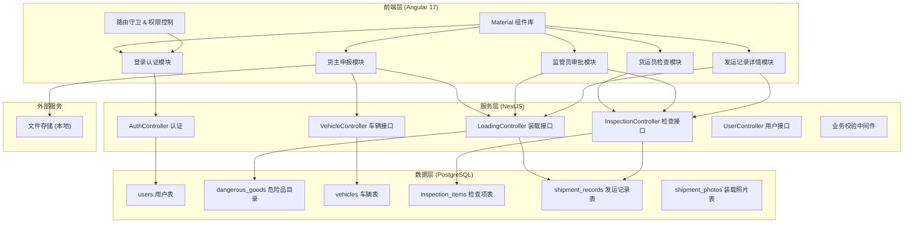
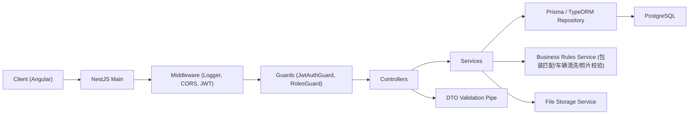
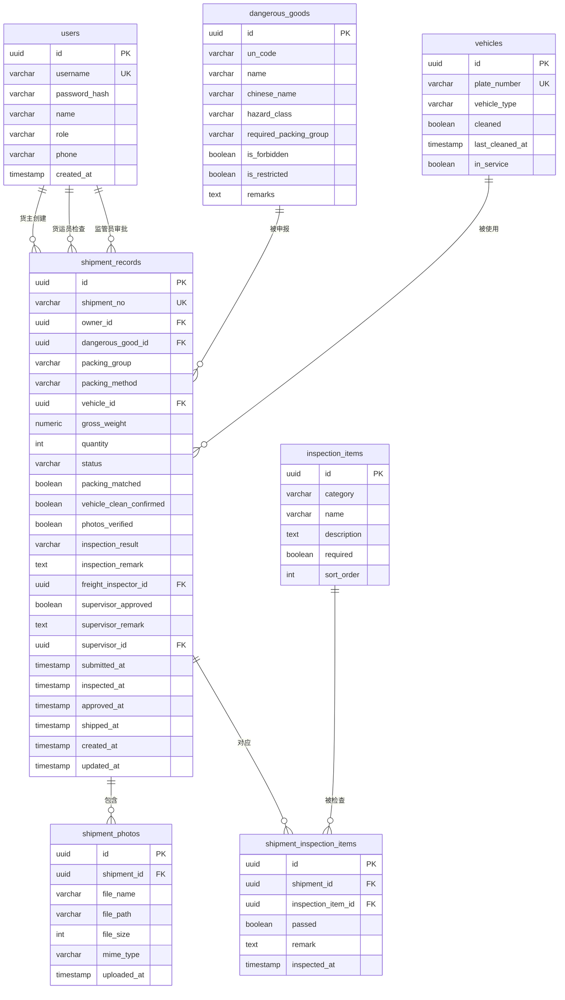

## 1. 架构设计



## 2. 技术描述

- **前端框架**: Angular 17 + TypeScript 5.3+
- **UI 组件库**: Angular Material 17
- **状态管理**: Angular Signals + RxJS
- **表单处理**: Angular Reactive Forms
- **路由**: Angular Router（带角色守卫）
- **HTTP 客户端**: Angular HttpClient（带拦截器处理 token）
- **后端框架**: NestJS 10 + TypeScript
- **ORM**: Prisma 5 / TypeORM
- **数据库**: PostgreSQL 15+
- **文件存储**: 本地文件系统（/uploads 目录）
- **认证**: JWT（access token + refresh token）
- **密码加密**: bcrypt
- **数据校验**: class-validator + class-transformer
- **API 文档**: Swagger / OpenAPI（@nestjs/swagger）
- **构建工具**:
  - 前端: Angular CLI
  - 后端: NestJS CLI
- **包管理器**: npm

## 3. 路由定义

| 路由 | 用途 | 角色权限 |
|------|------|----------|
| /login | 登录页（角色切换） | 公开 |
| /owner/dashboard | 货主首页 - 我的申报列表 | 货主 |
| /owner/submit | 货主申报 - 新建申报 | 货主 |
| /owner/detail/:id | 货主申报详情 | 货主 |
| /freight/dashboard | 货运员首页 - 待检任务列表 | 货运员 |
| /freight/inspect/:id | 货运员检查页 | 货运员 |
| /supervisor/dashboard | 监管员首页 - 数据看板 | 监管员 |
| /supervisor/approve | 监管员禁限运审批列表 | 监管员 |
| /supervisor/records | 监管员全量发运记录 | 监管员 |
| /shipment/:id | 发运记录详情（所有登录角色可访问自己权限范围内的） | 登录用户 |
| / | 默认重定向至对应角色首页 | - |

## 4. API 定义

### 4.1 认证接口

```typescript
// POST /api/auth/login
interface LoginRequest {
  username: string;
  password: string;
  role: 'owner' | 'freight' | 'supervisor';
}
interface LoginResponse {
  accessToken: string;
  refreshToken: string;
  user: {
    id: string;
    username: string;
    role: string;
    name: string;
  };
}

// POST /api/auth/refresh
interface RefreshRequest { refreshToken: string; }
interface RefreshResponse { accessToken: string; }
```

### 4.2 危险品目录接口

```typescript
// GET /api/dangerous-goods?keyword=xxx
interface DangerousGood {
  id: string;
  unCode: string;          // UN编号
  name: string;            // 品名
  chineseName: string;     // 中文品名
  hazardClass: string;     // 危险等级 1-9类
  requiredPackingGroup: 'I' | 'II' | 'III'; // 要求包装等级
  isForbidden: boolean;    // 是否禁运
  isRestricted: boolean;   // 是否限运
  remarks: string;
}
```

### 4.3 车辆接口

```typescript
// GET /api/vehicles?status=cleaned
interface Vehicle {
  id: string;
  plateNumber: string;     // 车牌号/车辆编号
  vehicleType: string;     // 车型
  cleaned: boolean;        // 是否已清洗确认
  lastCleanedAt: string | null;
  inService: boolean;
}

// POST /api/vehicles/:id/confirm-clean
interface ConfirmCleanResponse {
  success: boolean;
  cleaned: true;
  confirmedAt: string;
}
```

### 4.4 装载申报接口

```typescript
// POST /api/shipments  (货主创建申报)
interface CreateShipmentRequest {
  dangerousGoodId: string;
  packingGroup: 'I' | 'II' | 'III';   // 实际包装等级
  packingMethod: string;               // 包装方式
  vehicleId: string;
  grossWeight: number;                 // 毛重(kg)
  quantity: number;                    // 件数
  photos: string[];                    // 照片文件ID数组
  remarks?: string;
}

// GET /api/shipments?status=&role=
// GET /api/shipments/:id
interface ShipmentRecord {
  id: string;
  shipmentNo: string;                 // 发运单号
  ownerId: string;
  dangerousGood: DangerousGood;
  packingGroup: string;
  packingMethod: string;
  vehicle: Vehicle;
  grossWeight: number;
  quantity: number;
  status: 'draft' | 'submitted' | 'inspecting' | 'pending_approval' | 'approved' | 'rejected' | 'shipped';
  packingMatched: boolean | null;
  vehicleCleanConfirmed: boolean | null;
  photosVerified: boolean | null;
  inspectionResult: 'pass' | 'fail' | null;
  inspectionRemark: string | null;
  freightInspectorId: string | null;
  supervisorApproved: boolean | null;
  supervisorRemark: string | null;
  supervisorId: string | null;
  photos: ShipmentPhoto[];
  createdAt: string;
  submittedAt: string | null;
  inspectedAt: string | null;
  approvedAt: string | null;
  shippedAt: string | null;
}

// POST /api/shipments/:id/submit     (货主提交)
// POST /api/shipments/:id/inspect    (货运员执行检查)
interface InspectRequest {
  inspectionItems: { itemId: string; passed: boolean; remark?: string }[];
  vehicleCleanConfirmed: boolean;
  photosVerified: boolean;
  overallResult: 'pass' | 'fail';
  remark?: string;
}

// POST /api/shipments/:id/approve    (监管员审批禁限运)
interface ApproveRequest {
  approved: boolean;
  remark?: string;
}

// POST /api/shipments/:id/ship       (确认发运)
```

### 4.5 检查项接口

```typescript
// GET /api/inspection-items
interface InspectionItem {
  id: string;
  category: string;        // 加固/消防/标识/其他
  name: string;            // 检查项名称
  description: string;     // 检查说明
  required: boolean;       // 是否必查
  sortOrder: number;
}
```

### 4.6 文件上传接口

```typescript
// POST /api/upload/photo   (multipart/form-data, field: file)
interface UploadResponse {
  fileId: string;
  fileName: string;
  url: string;
  size: number;
}

// GET /api/files/:id       (下载/预览)
```

## 5. 服务端架构图



## 6. 数据模型

### 6.1 ER 图



### 6.2 DDL（PostgreSQL）

```sql
-- 用户表
CREATE TABLE users (
    id UUID PRIMARY KEY DEFAULT gen_random_uuid(),
    username VARCHAR(50) UNIQUE NOT NULL,
    password_hash VARCHAR(255) NOT NULL,
    name VARCHAR(100) NOT NULL,
    role VARCHAR(20) NOT NULL CHECK (role IN ('owner', 'freight', 'supervisor')),
    phone VARCHAR(20),
    created_at TIMESTAMP DEFAULT CURRENT_TIMESTAMP
);

-- 危险品目录
CREATE TABLE dangerous_goods (
    id UUID PRIMARY KEY DEFAULT gen_random_uuid(),
    un_code VARCHAR(20),
    name VARCHAR(200) NOT NULL,
    chinese_name VARCHAR(200),
    hazard_class VARCHAR(20),
    required_packing_group VARCHAR(5) CHECK (required_packing_group IN ('I', 'II', 'III')),
    is_forbidden BOOLEAN DEFAULT FALSE,
    is_restricted BOOLEAN DEFAULT FALSE,
    remarks TEXT
);

-- 车辆表
CREATE TABLE vehicles (
    id UUID PRIMARY KEY DEFAULT gen_random_uuid(),
    plate_number VARCHAR(50) UNIQUE NOT NULL,
    vehicle_type VARCHAR(100),
    cleaned BOOLEAN DEFAULT FALSE,
    last_cleaned_at TIMESTAMP,
    in_service BOOLEAN DEFAULT TRUE
);

-- 检查项表
CREATE TABLE inspection_items (
    id UUID PRIMARY KEY DEFAULT gen_random_uuid(),
    category VARCHAR(50) NOT NULL,
    name VARCHAR(200) NOT NULL,
    description TEXT,
    required BOOLEAN DEFAULT TRUE,
    sort_order INT DEFAULT 0
);

-- 发运记录表
CREATE TABLE shipment_records (
    id UUID PRIMARY KEY DEFAULT gen_random_uuid(),
    shipment_no VARCHAR(50) UNIQUE NOT NULL,
    owner_id UUID NOT NULL REFERENCES users(id),
    dangerous_good_id UUID NOT NULL REFERENCES dangerous_goods(id),
    packing_group VARCHAR(5) NOT NULL CHECK (packing_group IN ('I', 'II', 'III')),
    packing_method VARCHAR(200),
    vehicle_id UUID NOT NULL REFERENCES vehicles(id),
    gross_weight NUMERIC(12,2),
    quantity INT,
    status VARCHAR(30) NOT NULL DEFAULT 'draft' CHECK (status IN ('draft','submitted','inspecting','pending_approval','approved','rejected','shipped')),
    packing_matched BOOLEAN,
    vehicle_clean_confirmed BOOLEAN,
    photos_verified BOOLEAN,
    inspection_result VARCHAR(10) CHECK (inspection_result IN ('pass', 'fail')),
    inspection_remark TEXT,
    freight_inspector_id UUID REFERENCES users(id),
    supervisor_approved BOOLEAN,
    supervisor_remark TEXT,
    supervisor_id UUID REFERENCES users(id),
    submitted_at TIMESTAMP,
    inspected_at TIMESTAMP,
    approved_at TIMESTAMP,
    shipped_at TIMESTAMP,
    created_at TIMESTAMP DEFAULT CURRENT_TIMESTAMP,
    updated_at TIMESTAMP DEFAULT CURRENT_TIMESTAMP
);

-- 装载照片表
CREATE TABLE shipment_photos (
    id UUID PRIMARY KEY DEFAULT gen_random_uuid(),
    shipment_id UUID NOT NULL REFERENCES shipment_records(id) ON DELETE CASCADE,
    file_name VARCHAR(255) NOT NULL,
    file_path VARCHAR(500) NOT NULL,
    file_size INT,
    mime_type VARCHAR(100),
    uploaded_at TIMESTAMP DEFAULT CURRENT_TIMESTAMP
);

-- 发运检查项明细
CREATE TABLE shipment_inspection_items (
    id UUID PRIMARY KEY DEFAULT gen_random_uuid(),
    shipment_id UUID NOT NULL REFERENCES shipment_records(id) ON DELETE CASCADE,
    inspection_item_id UUID NOT NULL REFERENCES inspection_items(id),
    passed BOOLEAN NOT NULL,
    remark TEXT,
    inspected_at TIMESTAMP DEFAULT CURRENT_TIMESTAMP,
    UNIQUE (shipment_id, inspection_item_id)
);

-- 索引
CREATE INDEX idx_shipments_status ON shipment_records(status);
CREATE INDEX idx_shipments_owner ON shipment_records(owner_id);
CREATE INDEX idx_shipments_created ON shipment_records(created_at DESC);
CREATE INDEX idx_dg_name ON dangerous_goods(chinese_name);
CREATE INDEX idx_vehicles_cleaned ON vehicles(cleaned, in_service);
```

### 6.3 初始数据

```sql
-- 示例用户（密码均为 123456，需 bcrypt 哈希后实际插入）
INSERT INTO users (username, password_hash, name, role, phone) VALUES
('owner01', '$2b$10$...', '货主张三', 'owner', '13800000001'),
('freight01', '$2b$10$...', '货运员李四', 'freight', '13800000002'),
('super01', '$2b$10$...', '监管员王五', 'supervisor', '13800000003');

-- 示例危险品
INSERT INTO dangerous_goods (un_code, name, chinese_name, hazard_class, required_packing_group, is_forbidden, is_restricted, remarks) VALUES
('UN1203', 'Gasoline', '汽油', '3', 'II', false, false, '易燃液体'),
('UN1090', 'Acetone', '丙酮', '3', 'II', false, false, ''),
('UN1403', 'Calcium carbide', '碳化钙', '4.3', 'I', false, true, '遇水放出易燃气体，需审批'),
('UN0001', 'Explosive sample', '爆炸品样品', '1.1', 'I', true, false, '禁运品示例');

-- 示例车辆
INSERT INTO vehicles (plate_number, vehicle_type, cleaned, in_service) VALUES
('京A12345', '罐式货车', true, true),
('京B67890', '厢式货车', false, true),
('京C11111', '栏板货车', true, true);

-- 检查项
INSERT INTO inspection_items (category, name, description, required, sort_order) VALUES
('加固', '货物捆扎牢固', '检查所有捆扎带、绳索是否紧固', true, 1),
('加固', '衬垫齐全', '货物与车体接触处应有衬垫', true, 2),
('加固', '车门封条完好', '车门、厢门铅封或封条完好', true, 3),
('消防', '灭火器配备', '随车灭火器在有效期内', true, 4),
('标识', '危险标识粘贴', '按规定粘贴对应危险等级标识', true, 5),
('标识', '随车文件齐全', '托运单、安全技术说明书等文件齐全', true, 6);
```
